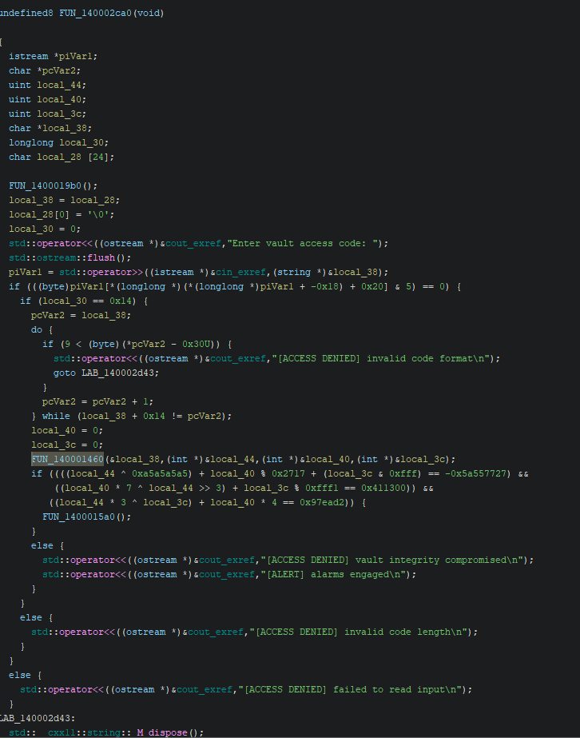

# Arturo’s Office Writeup

## Initial Recon

Open the binary in Ghidra.

### Step 1: Strings

Search for strings:

`Enter vault access code:`

This leads directly to the main function.

### Step 2: Confirming Main Function

Ghidra decompilation:

```c
undefined8 FUN_140002ca0(void)
```

This is the main logic.

#### Input Handling

Input code:

```c
std::operator<<(...,"Enter vault access code: ");
std::operator>>(cin, &local_38);

if (local_30 == 0x14)
```

What we can derive from this is that:
- Input is read as a string
- Length must be 20 characters

#### Digit Validation

```c
if (9 < (byte)(*pcVar2 - 0x30U))
```

So from this we can see that:
- Input must be strictly numeric

#### Splitting the Input

Call to another function:

```c
FUN_140001460(&local_38, &local_44, &local_40, &local_3c);
```

This function extracts three integers from the input and is passed along with the input.

## Function: `FUN_140001460` (Splitting Logic)

### Understanding Ghidra Variable Naming

Before we go into this function we need to understand the variable naming logic in ghidra 
Ghidra assigns generic names when symbols are stripped in the binary:

- `pcVarX` - pointer to char (`char *`)
- `iVarX`  - integer (`int`)
- `param_X` - function argument
- `local_X` - local stack variable

These are just some of the multitude of variable names
```c
void FUN_140001460(undefined8 *param_1,int *param_2,int *param_3,int *param_4)
```

### Parameter Mapping

- `param_1` - pointer to input string that user gave
- `param_2` - output → first integer 
- `param_3` - output → second integer 
- `param_4` - output → third integer 
### Variable Breakdown

#### Pointer Variables
```c
char *pcVar2;
char *pcVar4;
char *pcVar5;
```

- `pcVar2` - base pointer → start of input string
- `pcVar5` - iterator pointer (moves forward)
- `pcVar4` - boundary pointer (marks loop end)

#### Integer Variables
```c
int iVar3;
```

- `iVar3` - accumulator used to build numbers from the user input 

### Core Logic: Base-10 Parsing

All loops follow this pattern:

```c
iVar3 = (digit) + iVar3 * 10;
```

Equivalent to:

```c
value = value * 10 + digit;
```

This converts ASCII digits into integers.

### Loop 1 — First 7 Digits

```c
pcVar4 = pcVar2 + 7;
pcVar5 = pcVar2;

do {
    cVar1 = *pcVar5;
    pcVar5++;
    iVar3 = (cVar1 - 0x30) + iVar3 * 10;
    *param_2 = iVar3;
} while (pcVar4 != pcVar5);
```

**Meaning:**
Reads characters from index `[0 → 6]` and builds an integer.
`d1 = input[0:7]`

### Loop 2 — Next 6 Digits

```c
pcVar5 = pcVar2 + 0xd;
do {
    cVar1 = *pcVar4;
    pcVar4++;
    iVar3 = (cVar1 - 0x30) + iVar3 * 10;
    *param_3 = iVar3;
} while (pcVar5 != pcVar4);
```

**Meaning:**
Reads characters from index `[7 → 12]`.
`d2 = input[7:13]`

### Loop 3 — Final 7 Digits

```c
do {
    cVar1 = *pcVar5;
    pcVar5++;
    iVar3 = (cVar1 - 0x30) + iVar3 * 10;
    *param_4 = iVar3;
} while (pcVar5 != pcVar2 + 0x14);
```

**Meaning:**
Reads characters from index `[13 → 19]`.
`d3 = input[13:20]`

### Summary of Split

`input (20 digits)` -> `d1 = first 7 digits`, `d2 = next 6 digits`, `d3 = last 7 digits`l

## Constraint Checks (Core Logic)

After splitting, the function returns to main where the core checking happens

```c
if (
    ((d1 ^ 0xa5a5a5a5) + d2 % 0x2717 + (d3 & 0xfff) == -0x5a557727) &&
    ((d2 * 7 ^ d1 >> 3) + d3 % 0xfff1 == 0x411300) &&
    ((d1 * 3 ^ d3) + d2 * 4 == 0x97ead2)
)
```

### Constraint 1

`(d1 ^ 0xA5A5A5A5) + (d2 % 10007) + (d3 & 0xFFF)`

**Components:**
- `d1 ^ 0xA5A5A5A5`: Bitwise XOR → introduces non-linearity
- `d2 % 10007`: Reduces value into bounded range
- `d3 & 0xFFF`: Keeps lower 12 bits

**Constant:**
`-0x5a557727` is a signed representation. Convert to unsigned to get `0xA5AA88D9`.

### Constraint 2

`((d2 * 7) ^ (d1 >> 3)) + (d3 % 65521)`

**Components:**
- `d2 * 7`: scales value
- `d1 >> 3`: bit-level dependency
- XOR combines them
- `d3 % 65521`: prime modulus

### Constraint 3

`(d1 * 3 ^ d3) + d2 * 4`

**Components:**
- `d1 * 3`: XOR with d3
- `d2 * 4` added

## Solving the Equations

Now that we know the mathematical constraints, we can script a way to solve this system rather than brute-forcing it manually by guessing inputs. The optimal approach is to use symbolic execution tool like angr or z3.
### Solve Script 

Using Z3, we can define the exact constraint values we found for d1,d2,d3

```python
from z3 import *

# 32-bit vars
A = BitVec('A', 32)
B = BitVec('B', 32)
C = BitVec('C', 32)

s = Solver()

# bounds from decimal digit lengths
s.add(A >= 0, A <= 9999999)
s.add(B >= 0, B <= 999999)
s.add(C >= 0, C <= 9999999)

# constraints
s.add(((A ^ 0xa5a5a5a5) + URem(B, 0x2717) + (C & 0xfff)) == BitVecVal(-0x5a557727 & 0xffffffff, 32))
s.add(((B * 7 ^ LShR(A, 3)) + URem(C, 0xfff1)) == 0x411300)
s.add(((A * 3 ^ C) + B * 4) == 0x97ead2)

if s.check() == sat:
    m = s.model()

    a = m[A].as_long()
    b = m[B].as_long()
    c = m[C].as_long()

    result = f"{a:07d}{b:06d}{c:07d}"
    print(result)
else:
    print("no solution")
```

Running this script prints the magic 20-digit combination: `10397116105116111115`.

## Retrieving the Flag

Now we simply connect to the challenge server and input the 20 digit key
`10397116105116111115`

And we get the flag:

Enter vault access code: 10397116105116111115
[VAULT OPENED] HTB{4rtur0s_v4ult_br0k3n}

