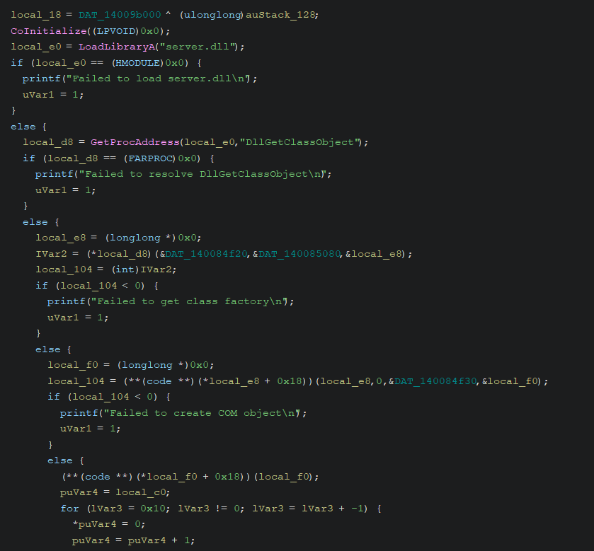
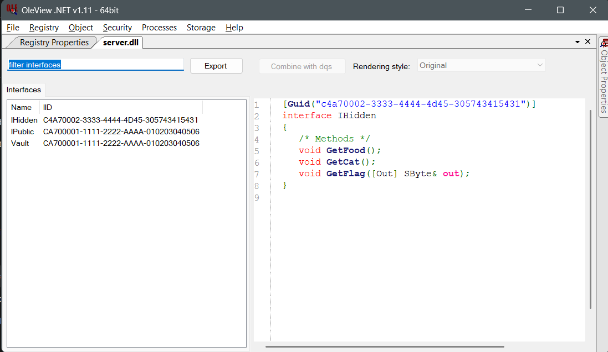
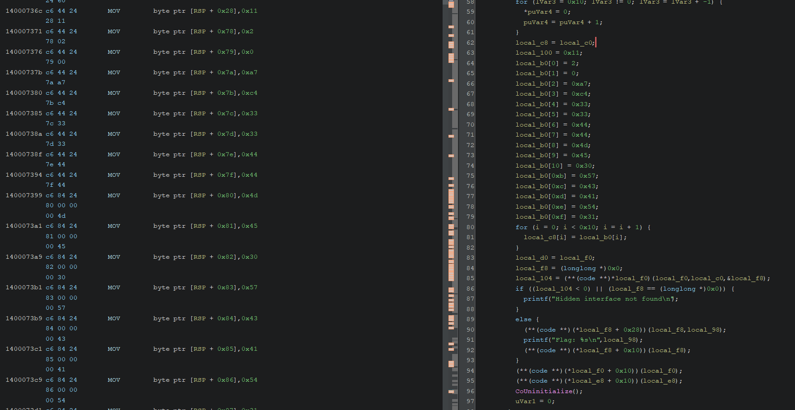

# Dali's DLL Writeup

## 1. Initial Recon

When we first run the binary (`client.exe` / `PATCHEDLOL.exe`), we get the following output:

```
Public interface executed.
Hidden interface not found
```

**Immediate observations:**
- It clearly has a multi-stage flow.
- The first part works absolutely fine (`Public interface executed.`).
- The program fails during some sort of secondary lookup step (`Hidden interface not found`).

## 2. Static Analysis, Checking Imports 

To understand the binary's behavior, we open the executable in **Ghidra** and inspect its Imports

Under the **Imports** tree, we find:
* `OLE32.dll`
  * `CoInitialize`
* `KERNEL32.dll`
  * `LoadLibraryA`
  * `GetProcAddress`

**Finding what the imports are:**
* `CoInitialize` - googling this term shows that the binary is interacting with the Component Object Model (COM).
* `LoadLibraryA` & `GetProcAddress` imply manual, dynamic symbol resolution and DLL loading.

This implies that the binary is using:
→ **Manual COM object loading** (No registry usage lookup via `CoCreateInstance` directly mapped).
→ An **In-process COM server** (DLL).

## 3. Identifying COM Usage & Understanding the Architecture 

Searching for strings or tracking function flow reveals the string `"DllGetClassObject"`.

**Why this matters:**
`DllGetClassObject` is the canonical COM export. Every COM DLL exposes `HRESULT DllGetClassObject(...)` as a standard Windows entry point for object instantiation logic. 

**What is COM?**
Before proceeding, it is crucial to understand what COM actually is. Microsoft introduced the Component Object Model (COM) as a language-neutral, object-oriented system for creating binary software components. It allows different software modules (often running in different processes or written in different languages) to interact seamlessly.

### COM Core Concepts & Interfaces

In COM, an **object** is purely a black box that exposes its functionality only through **Interfaces**. 
An interface is a strict contract a table of function pointers (a vtable) that defines exactly what methods an object supports.

* **`IUnknown`**: The foundational root of all COM interfaces. Every COM interface in existence *must* inherit from `IUnknown`. It provides three essential methods at the very top of the vtable:
  1. `QueryInterface()` - The COM discovery mechanism. It asks the object: *"Do you support this specific interface?"*
  2. `AddRef()` - Increments the reference count.
  3. `Release()` - Decrements the reference count.

### Identifiers (GUIDs)

Because COM aims to be universal and language agnostic, components and interfaces are not identified by names like `"Vault"` or `"HiddenInterface"`. Instead, they rely on 128 bit Globally Unique Identifiers or GUID's.
* **CLSID (Class Identifier)**: Identifies the exact COM class / implementation. If you want to instantiate the object, you look up its CLSID.
* **IID (Interface Identifier)**: Identifies a specific interface (the contract/methods). After getting the object, you request functionality based on its IID.

**Conclusion:** 
Because we see `CoInitialize` and `DllGetClassObject`, we know absolutely that this binary is manually loading and interacting with a COM object implemented within `server.dll`.

## 4. Reconstructing the Execution Flow

From the decompiled code in Ghidra, the execution flow breaks down as follows. Looking at `FUN_140007230`, we see:

1. **`CoInitialize((LPVOID)0x0)`:** Initializes the COM library.
2. **`local_e0 = LoadLibraryA("server.dll")`:** Manually loads the server DLL into the process space.
3. **`local_d8 = GetProcAddress(local_e0,"DllGetClassObject")`:** Grabs the COM entry point.
4. **`(*local_d8)(&DAT_140084f20,&DAT_140085080,&local_e8)`:** Calls `DllGetClassObject`. `local_e8` holds the resulting `IClassFactory` object.
5. **`(**(code **)(*local_e8 + 0x18))(local_e8,0,&DAT_140084f30,&local_f0)`:** Calls `CreateInstance` on the factory via vtable offset `+0x18` (the 4th method of `IClassFactory`). `local_f0` holds the returned actual COM object.
6. **`(**(code **)(*local_f0 + 0x18))(local_f0)`:** The client calls `PublicMethod()` via vtable offset `+0x18` -> Works successfully and prints `"Public interface executed."`
7. **Obfuscation Loop:** The client sets up an array `local_b0` and eventually constructs a hidden Interface ID (IID) into `local_c0` (via pointer `local_c8`). 
8. **`(**(code **)*local_f0)(local_f0,local_c0,&local_f8)`:** Calls `QueryInterface` (vtable offset `+0x00`, the 1st method of `IUnknown`) using the generated IID `local_c0` -> **FAILS**.



## 5. Connecting the Execution Flow to our COM Knowledge

Now that we understand COM, looking back at the reconstructed flow, the story becomes clear. 

**In the context of this challenge:**
* We are interacting with a COM Server (`server.dll`) that implements a specific object class (CLSID).
* The object successfully exposes a **Public IID**. We see this when `PublicMethod()` executes perfectly.
* Deep within the object, a **Hidden IID** exists that probably contains the method Flag.
* When the client binary does `QueryInterface(&iid, &pOut)`, it is literally asking `server.dll` for this hidden functionality. 
* The mapped target **Public IID** is correct in the intialisation and works as intended
* The mapped target **Hidden IID** is obscured through an XOR loop, yielding garbage and it fails when we run it.

## 6. Identifying the Problem Area

Looking into the decompiled function `FUN_140007230` where the "Hidden interface not found" error spawns, we spot a loop dynamically constructing the target IID initially:

```c
for (i = 0; i < 0x10; i = i + 1) {
  local_c8[i] = local_b0[i] ^ (i + 0x11);
}
```

**Interpretation:** 
Stored bytes (`local_b0`) are mathematically transformed to dictate the actual target IID (`local_c8` / `local_c0`). 

When it executes `(**(code **)*local_f0)(local_f0,local_c0,&local_f8);` (which translates to `pObj->QueryInterface(&iid, &pOut)`), it fails. Because we are failing the `QueryInterface` call, we know: **The constructed IID is incorrect because the original array bytes are obfuscated.**

## 7. Where to Get the Real IID

To fix the call, we need the correct hidden IID. There are two paths:

### Path A — Reverse the XOR locally 

If we hypothetically knew the targeted real bytes, we could reverse the logic:
`real[i] = stored[i] ^ (i + 0x11)`

### Path B — Understand the Server & Using OleView.Net 

Because the client is specifically loading `server.dll` and failing at the `QueryInterface` step, evaluating the server library itself is the most powerful way to find what we are looking for. `server.dll` is an in process COM handler. Modern COM components sometimes embed what is called a **Type Library** (TypeLib) directly in the file to allow other languages to safely interoperate with them.

We can inspect this by opening `server.dll` in a tool specialized for this exact architecture: **OleView.Net**.

1. Open `server.dll` in **OleView.Net**.
2. Open the file via `File -> Open TypeLib`.
3. Expand and inspect the defined Interfaces.
4. You will immediately see the public interface, but right alongside it sits the hidden GUID.



Inside the `IID_IHidden` definition, we will find its exact name, its methods (like `GetFlag`), and most importantly, its raw GUID:
`{C4A70002-3333-4444-4D45-305743415431}`

**A Note on Endianness before we patch** 
We must understand how GUIDs are stored in memory. A GUID structure (`struct _GUID`) is *not* a simple flat sequence of 16 linear bytes matching the string format. It is officially defined as:

```c
typedef struct _GUID {
  DWORD Data1;    // 4 bytes (Little Endian)
  WORD  Data2;    // 2 bytes (Little Endian)
  WORD  Data3;    // 2 bytes (Little Endian)
  BYTE  Data4[8]; // 8 bytes (Linear / Big Endian)
} GUID;
```

Because of Windows traversing the first three fields as standard integer types, they are stored backward in **Little Endian** order. 
Therefore, the pretty-printed GUID string `{C4A70002-3333-4444-4D45-305743415431}` actually maps to bytes like this:

* `C4A70002` (DWORD) -> Reverses to: `02 00 A7 C4`
* `3333` (WORD) -> Reverses to: `33 33`
* `4444` (WORD) -> Reverses to: `44 44`
* `4D45-305743415431` (BYTE array) -> Stays sequential: `4D 45 30 57 43 41 54 31`

So when we inject the raw memory, the literal 16-byte hex array we need is:
`02 00 A7 C4 33 33 44 44 4D 45 30 57 43 41 54 31`

## 8. Patching 

1. Remove the XOR logic constraint via binary patching (e.g., NOP out the XOR instruction).
2. Directly patch the actual Hidden IID bytes into the binary's memory where the stored buffer is initialized.
3. Replace the stored array (`local_b0`) with the real `IID`:
   `02 00 A7 C4 33 33 44 44 4D 45 30 57 43 41 54 31`




## 9. GetFLag

Executing the patched binary (`PATCHED.exe`):

```bash
❯ .\PATCHED.exe
Public interface executed.
Flag: HTB{C0M_1NT3RF4C3_0BFU5C4T10N}
```
